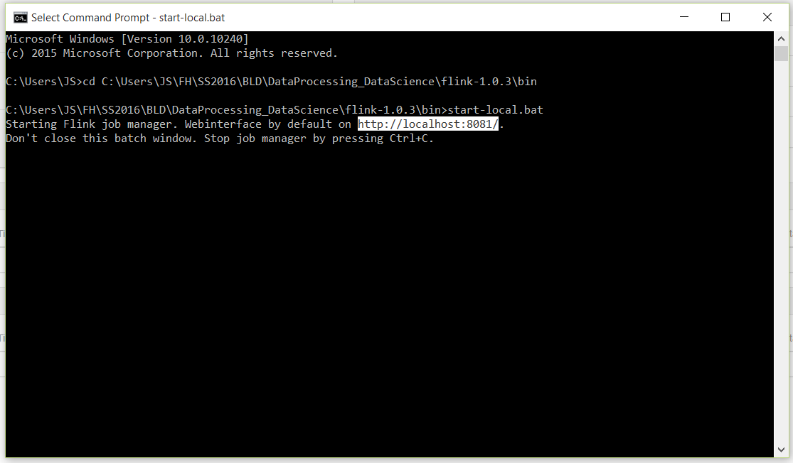
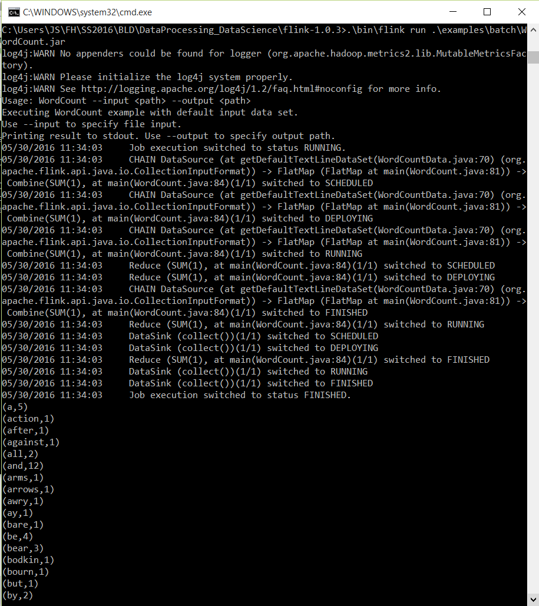
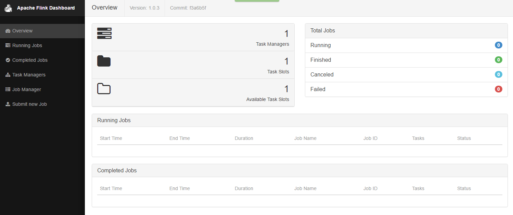
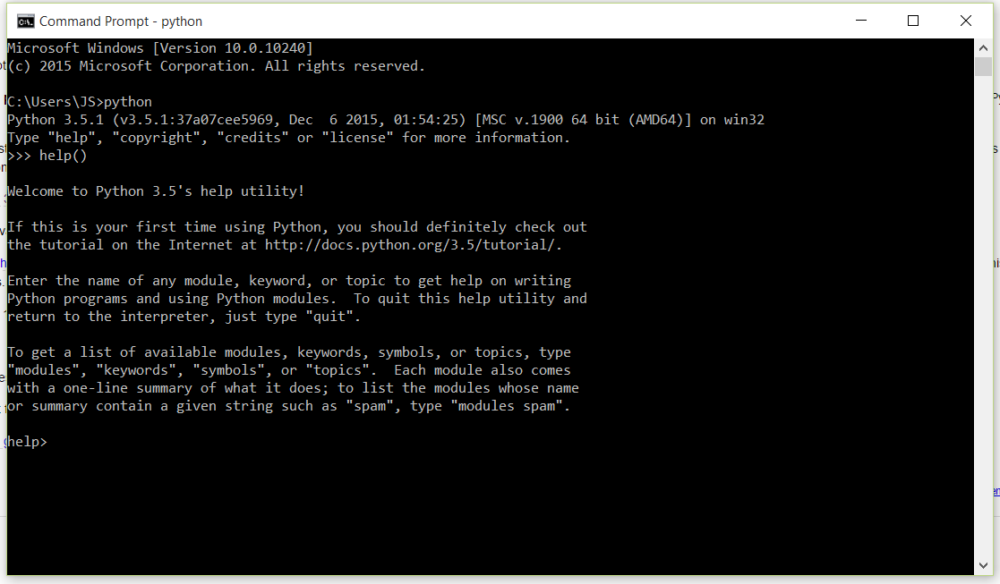
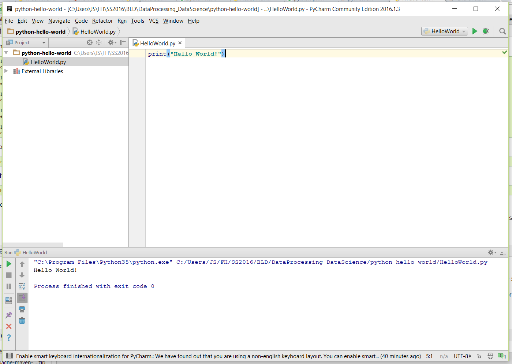

# Big Data - Hausübung

## Data Engineering

### Assignment 1: Big Data in Ihrem Umfeld (4 Punkte)

#### 1.1 (2 Punkte)
*Schauen Sie sich in Ihrem Umfeld um. FH Technikum oder Ihr Job. Nennen Sie mindestens ein Beispiel für Daten, die schemalos (unstrukturiert) sind und mindestens ein Bespiel für Daten, die strukturiert (schematisch) sind.*

Schemalos (unstrukturiert): 
 - Emails von FH und aus der Arbeit
 - Dokumente und Unterlagen im Moodle der FH
 - Skype Nachrichten in der Arbeit

Strukturiert (schematisch): 
 - Daten in relationaler Datenbank in der Arbeit (z.B. User-Daten, Daten zu Kundenbestellungen, ...)

#### 1.2 (2 Punkte)
*Nennen Sie ein Beispiel für Daten in Ihrem Umfeld, die gestreamt verarbeitet werden, nennen Sie ein Beispiel für Daten in Ihrem Umfeld, die über Batchverarbeitung verarbeitet werden.*

Stream: 
 - Information zu Besuchern der Web-Applikation und Nutzeraktivität (Web Metrics) --> diese Daten werden sofort vom Client an Services der Web-Applikation & Google Analytics weitergeleitet und dort verarbeitet.
 - Bei jedem Eingang einer neuen Bestellung werden gleich die Umsatzstatisiken für den Fotografen upgedatet.

Batch: 
 - Neu hochgeladene Fotos in der Web-Applikation werden anschließend in Batches von jeweils 100 Fotos mit Wasserzeichen überlagert.

### Assignment 2: Big Data in Ihrem Umfeld (4 Punkte)
*Entscheiden Sie sich für eine Data Engineering Plattform. Apache Flink oder Apache Spark.*   
*Installieren Sie die auf Ihrem Arbeitsgerät.*

 *1. Erklären Sie ihre Entscheidung.*   
 *2. Schicken Sie einen Screenshot der installierten Umgebung mit.*    
 *3. Beschreiben Sie Ihre Toolchain, die Sie mit dem Framework nutzen würden (z.B: IDE)*

 1. Ich habe mich für Apache Flink entschieden, weil mich besonders die Streamverarbeitung interessiert und Apache Flink für diesen Bereich besser geeignet ist. Auch in der Arbeit könnte dies relevant werden und da mit Apache Flink auch Batch-Verarbeitung möglich ist, kann ich mir so eine Plattform ansehen, in der beides gelöst werden kann. 
 2. Screenshots:
 
 Flink - Command Line
 
 Flink - Example Run
 
 Flink - Web Frontend
 
 3. Als Entwicklungsumgebung für Java wird die IDE IntelliJ eingesetzten und Maven als Build Tool verwenden. 
 
### Assignment 3: Big Data in Ihrem Umfeld (4 Punkte)
*Schreiben Sie ein simples Program mit dem Framework (z.B. Helloworld) und laden Sie es hoch.*
 - *2 Punkte für Programm* 
 - *2 Punkte, wenn das Programm auch ausführbar ist.*

Der Ordner "flink-java-project" enthält das IntelliJ Projekt fürs Programm. Die Klasse "HelloWorldCount" enthält den eigentlichen Code des Progamms.

Mit dem JAR-File "flink-java-project-0.1.jar" kann das Programm in Flink ausgeführt werden.

    flink run flink-java-project-0.1.jar

----------

## Data Science

### Assignment 1: Technologien (4 Punkte)

#### 1.1 (2 Punkte)
*Sie haben in der LVA zwei Frameworks kennengelernt (R und Python). Nennen Sie zwei weitere Technologien, um Daten zu analysieren (müssen nicht open source sein)*

 - Julia
 - Scala (basiert auf Java)
 - Go (von Google)

#### 1.2 (2 Punkte)
*Sie bekommen den Auftrag, sich mit einer Data Science Technologie zu arbeiten. Nennen Sie Technologie, die ihnen auf dem ersten Blick am besten für Sie ersscheint und begründen Sie das!*

Ich würde mich für Python entscheiden, da es laut vielen Meinungen im Internet etwas leichter zu lernen ist, wenn man aus dem Engineering-Bereich kommt und weniger aus der Mathematik/Statistik. Außerdem ist es eine Sprache, die auch in der Web-Entwicklung eingesetzt wird und auch in Web-Applikation eingebunden werden kann, was für die Arbeit sehr relevant werden kann.

### Assignment 2: Technologien (4 Punkte)
*Entscheiden Sie sich für eine Data Science Plattform. R oder Python*    
*Installieren Sie die auf Ihrem Arbeitsgerät.*    
 *1. Begründen Sie ihre Entscheidung (Warum ziehen Sie persönlich aus ihrer Ausgangssituation die eine Technologie der anderen vor).*    
 *2. Schicken Sie einen Screenshot der installierten Umgebung mit*    
 *3. Beschreiben Sie Ihre Toolchain, die Sie mit dem Framework nutzen (z.B. IDE)*

 1. Ich habe mich aus den selben Gründen, wie schon bei Punkt 1.2 des vorherigen Assignment 1 erläutert, für Python entschieden. 
 2. Screenshots:
 
 Python - Command Line
 
 Python - Hello World Example
 
 3. Als Entwicklungsumgebung für Python wird die IDE PyCharm eingesetzt. 

### Assignment 3: Big Science (4 Punkte)
*Der Cheatsheet auf http://scikit-learn.org/stable/tutorial/machine_learning_map/ ist eine einfache Anleitung, wie man den richtigen Algorithmus zum richtigen Data Science Problem findet. Schauen Sie in Google nach und lernen Sie classificatiom, regression, clusting und dimensional reduction unterscheiden.*     
*Nennen Sie ein Beispiel aus ihrem Umfeld, wo Sie mit dem Algorithmus zu tun haben. Das kann ein Beispiel sein, wie: Wenn Sie bei Amazon einkaufen. Wenn Sie von einem Marketinginstitut angerufen werden, etc.*

Classification:   
Vorgegebene Kategorien/Klassen, denen die Daten zugeordnet werden   
Beispiel: Klassifizierung von Emails als Spam

Regression:    
Ermittlung eines echten numerischen Wertes für eine bestimmte Eigenschaft eines Objektes   
Beispiel: Wenn man eine neue Wohnung zum Vermieten bei AirBnb reinstellt, wird einem Preis vorgeschlagen, der für diese Art von Wohnung (Größe, Lage, …) passt.

Clustering:   
Keine Kategorie vorgegeben, stattdessen werden ähnliche Daten zu Gruppen zusammengefasst    
Beispiel: Analyse aller Kunden mit Billa-Kundenkarte und Gruppierung in Markt-Segmente, um Angebote besser abstimmen zu können

Dimensional Reduction:     
Reduzierung der großen Anzahl an Dimension von Daten auf weniger aber wesentliche und aussagekräftige Dimensionen  
Beispiel: 

